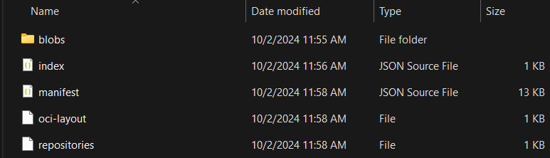
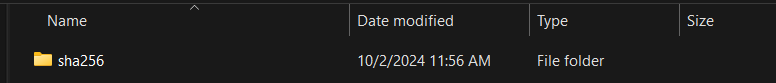
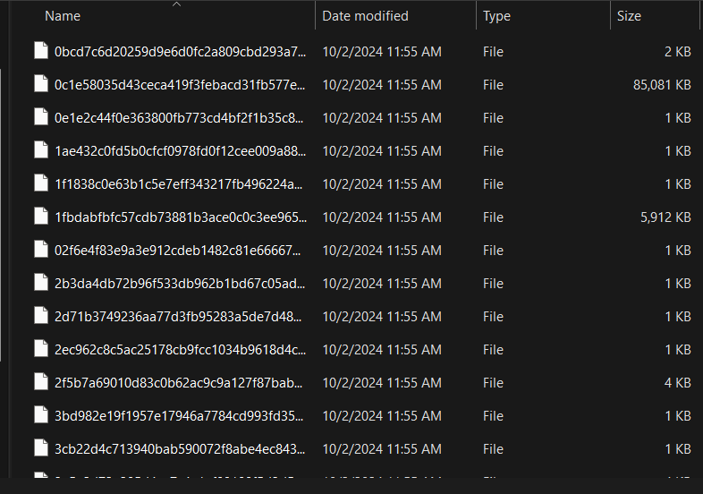
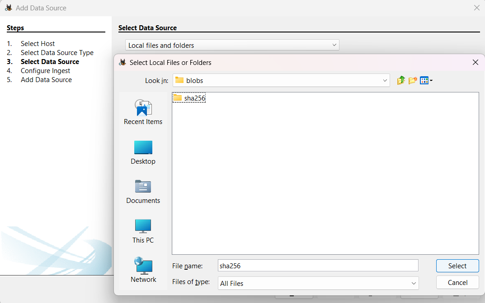
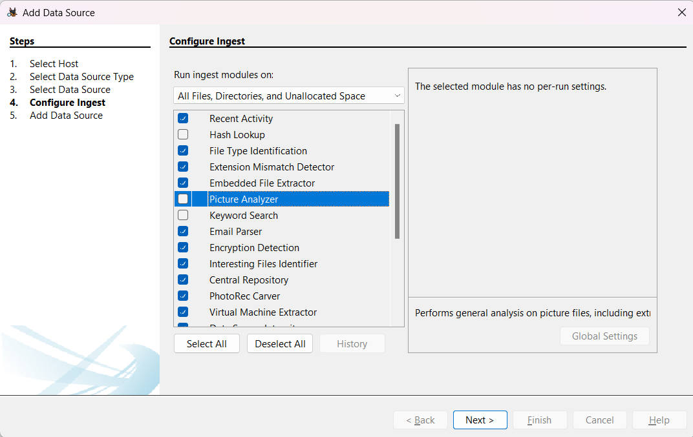
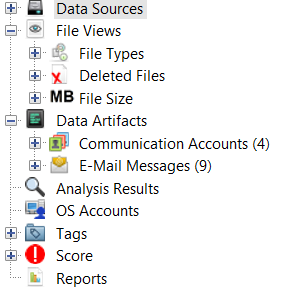
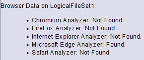
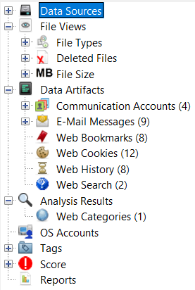
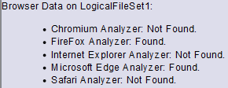

## Data Artifacts Problem (Autopsy)
### Firefox
#### Firefox installation
```bash
wget -O /tmp/firefox.tar.bz2 "https://download.mozilla.org/?product=firefox-latest&os=linux64&lang=en-US"
tar -xjf /tmp/firefox.tar.bz2 -C /opt/
ln -s /opt/firefox/firefox /usr/local/bin/
rm /tmp/firefox.tar.bz2
```

#### Firefox profile
```bash
firefox --headless -CreateProfile "SarahWilliams /root/.mozilla/firefox/profiles/sarahwilliams"
```

#### Content of firefox profile
```bash
root@6f60a80ef7f3:~/.mozilla/firefox/profiles/sarahwilliams# ls
AlternateServices.bin              cookies.sqlite              favicons.sqlite-wal  prefs.js                            storage.sqlite
addonStartup.json.lz4              cookies.sqlite-wal          handlers.json        protections.sqlite                  times.json
bookmarkbackups                    crashes                     key4.db              search.json.mozlz4                  user.js
bounce-tracking-protection.sqlite  datareporting               lock                 security_state                      webappsstore.sqlite
broadcast-listeners.json           extension-preferences.json  minidumps            sessionCheckpoints.json             webappsstore.sqlite-wal
cert9.db                           extension-store             permissions.sqlite   sessionstore-backups                xulstore.json
compatibility.ini                  extension-store-menus       pkcs11.txt           sessionstore.jsonlz4
containers.json                    extensions.json             places.sqlite        shield-preference-experiments.json
content-prefs.sqlite               favicons.sqlite             places.sqlite-wal    storage
```

#### Content of profiles.ini
```bash
root@6f60a80ef7f3:~/.mozilla/firefox# ls
'Crash Reports'  'Pending Pings'   profiles   profiles.ini

root@6f60a80ef7f3:~/.mozilla/firefox# cat profiles.ini
[Profile0]
Name=SarahWilliams
IsRelative=1
Path=profiles/sarahwilliams
Default=1

[General]
StartWithLastProfile=1
Version=2
```

### Image from Docker
#### Extraction
```bash
docker ps -a # to see the container_id
docker commit container_id test01_fs
docker save -o C:\Path\To\Dir\test01_fs.tar test01_fs
```

#### Content of the extracted folder


#### Content of blobs


#### Content of sha256


### Autopsy
#### Add Data source


#### Run Ingest modules


#### Result



#### Run Ingest Modules Again with Result
By running the ingest modules again Autopsy, with Recent Activity, is able to find firefox (FireFox Analyzer: Found) and add to Data Artifacts additional information related to the browser. \
