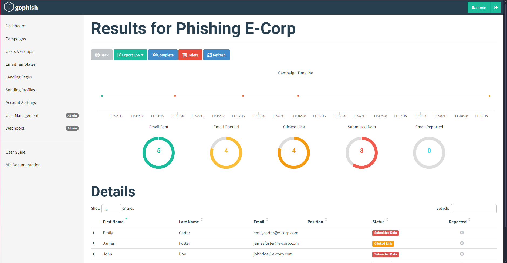
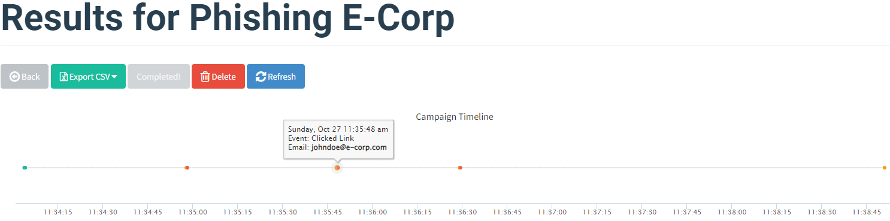
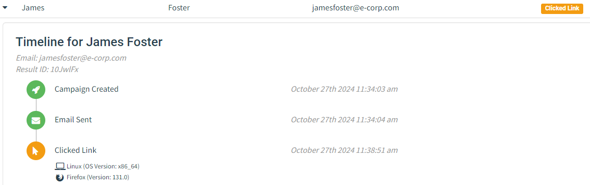
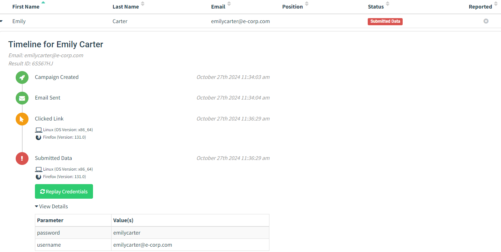

## Campaign
- Name: Phishing Simulation
- Email Template: Name of the template created
- Landing Page: Name of the landing page created
- URL: http://203.0.113.3
- Launch Date: October 13th 2024, 12:20 pm
- Sending Profile: Name of the profile created
- Groups: Name of the group created

The **URL** is the ip address of the GoPhish server that will host the landing page. 

### Results
The result of the GoPhish campaign are:

    
    

### Clicked Link
This is what GoPhish shows about the interaction of the victim with the malicious url (in this case the victim only opened the link):

    

### Credentials Submitted
This is what GoPhish shows about the interaction of the victim with the malicious url (in this case the victim opened the link and then inserted the credentials):

    

