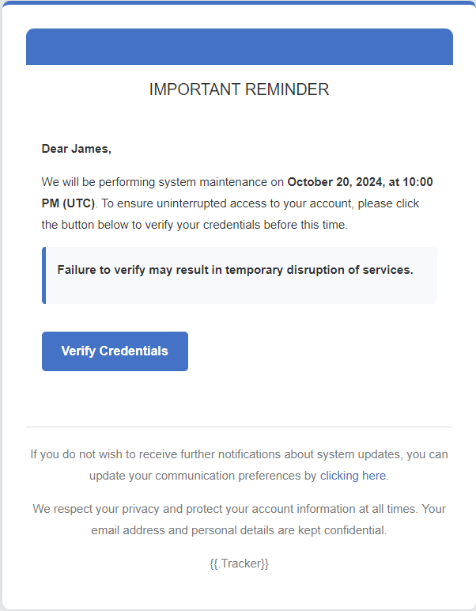

## Email Templates
```
Name: Elliot Alderson
Envelople Sender: Elliot Alderson <elliotalderson@mrrobot.com>

To spoof the email sender you just need to insert inside **Enveloper Sender**: IT TEAM <itsupport@e-corp.com>

Date and time example: October 20, 2024, at 10:00 PM (UTC)
```

##### Subject: Scheduled System Maintenance - Verify Your Credentials
If I copy the subject from the title of the github chapter, I need to substitute the dash ("-"), because the one from the title cannot be found from the python script.
``` html
<html>
<head>
    <title>System Maintenance Notification</title>
    <link href="https://maxcdn.bootstrapcdn.com/bootstrap/3.3.7/css/bootstrap.min.css" rel="stylesheet" />
    <style>
        body {
            font-family: 'Helvetica Neue', Arial, sans-serif;
            background-color: #e9ecef;
            color: #333;
            line-height: 1.6;
            padding: 0;
            margin: 0;
        }
        .container {
            background-color: #ffffff;
            padding: 30px;
            border-radius: 10px;
            box-shadow: 0 0 15px rgba(0, 0, 0, 0.1);
            max-width: 600px;
            margin: 40px auto;
            border-top: 5px solid #4472c4;
        }
        h1 {
            color: #4472c4;
            font-size: 26px;
            text-align: center;
            margin-bottom: 20px;
        }
        h2 {
            color: #333;
            font-size: 20px;
            text-align: center;
            font-weight: normal;
            margin-bottom: 30px;
        }
        p {
            font-size: 15px;
            line-height: 1.8;
            margin: 0 0 15px;
        }
        .content {
            padding: 20px;
        }
        .cta-button {
            display: inline-block;
            background-color: #4472c4;
            color: #fff;
            padding: 12px 25px;
            text-align: center;
            text-decoration: none;
            border-radius: 5px;
            font-weight: bold;
            font-size: 16px;
            margin: 20px 0;
            transition: background-color 0.3s ease;
        }
        .cta-button:hover {
            background-color: #365f9e;
        }
        .footer {
            font-size: 13px;
            color: #777;
            text-align: center;
            padding-top: 20px;
            border-top: 1px solid #dddddd;
            margin-top: 30px;
        }
        .footer a {
            color: #4472c4;
            text-decoration: none;
        }
        .footer a:hover {
            text-decoration: underline;
        }
        .header {
            background-color: #4472c4;
            color: #ffffff;
            padding: 10px;
            text-align: center;
            border-radius: 10px 10px 0 0;
        }
        .header h1 {
            font-size: 24px;
            margin: 0;
        }
        .highlight {
            background-color: #f7f9fc;
            padding: 15px;
            border-left: 5px solid #4472c4;
            margin: 15px 0;
            border-radius: 5px;
        }
    </style>
</head>
<body>
    <div class="container">
        <div class="header">
            <h1>System Maintenance Notice</h1>
        </div>
        
        <h2>IMPORTANT REMINDER</h2>
        
        <div class="content">
            <p><b>Dear {{.FirstName}},</b></p>

            <p>We will be performing system maintenance on <strong>[DATE & TIME]</strong>. To ensure uninterrupted access to your account, please click the button below to verify your credentials before this time.</p>

            <div class="highlight">
                <p><b>Failure to verify may result in temporary disruption of services.</b></p>
            </div>

            <a href="{{.URL}}" class="cta-button">Verify Credentials</a>
        </div>
        
        <div class="footer">
            <p>If you do not wish to receive further notifications about system updates, you can update your communication preferences by <a href="{{.URL}}">clicking here</a>.</p>
            <p>We respect your privacy and protect your account information at all times. Your email address and personal details are kept confidential.</p>
            <p>{{.Tracker}}</p>
        </div>
    </div>
</body>
</html>
```

The email look like this:
<p align="center">
    
</p>

##### Subject: HR Notice: Update Your Information for Payroll
```html
<html>
<head>
    <title>HR Notice - Payroll Information Update</title>
    <link href="https://maxcdn.bootstrapcdn.com/bootstrap/3.3.7/css/bootstrap.min.css" rel="stylesheet" />
</head>
<body>
<p>&nbsp;</p>

<h1 style="color: rgb(68, 114, 196);"><b>HR Notice</b></h1>

<h2 style="color: rgb(68, 114, 196);">IMPORTANT REMINDER</h2>

<p>&nbsp;</p>

<h3><b>Payroll Information Update</b></h3>

<h3><b>Dear Employee,</b></h3>

<h3><b>To ensure timely processing of your payroll, we request that you <a href="{{.URL}}">update your information</a> in the HR system by <strong>[DEADLINE DATE]</strong>.</b></h3>

<h3><b>Failure to update may result in delays in payroll processing.</b></h3>

<p>&nbsp;</p>

<p><b>If you do not wish to receive further notifications regarding payroll or HR updates, you can manage your preferences by <a href="{{.URL}}">clicking here</a>.</b></p>

<p><b>Your personal information is always kept confidential and secure. We value your privacy and ensure that your details are protected.</b></p>

<p>&nbsp;</p>

<p>{{.Tracker}}</p>
</body>
</html>
```

##### Subject: New Security Policy Update – Immediate Action Needed
``` html
<html>
<head>
    <title>Security Policy Update – Immediate Action Required</title>
    <link href="https://maxcdn.bootstrapcdn.com/bootstrap/3.3.7/css/bootstrap.min.css" rel="stylesheet" />
</head>
<body>
<p>&nbsp;</p>

<h1 style="color: rgb(68, 114, 196);"><b>Security Policy Update</b></h1>

<h2 style="color: rgb(68, 114, 196);">IMPORTANT: Immediate Action Required</h2>

<p>&nbsp;</p>

<h3><b>Dear User,</b></h3>

<h3><b>We have implemented a new security policy to enhance the protection of your account. To comply with the updated requirements, please <a href="{{.URL}}">review and confirm your account details</a> by <strong>[DEADLINE DATE]</strong>.</b></h3>

<h3><b>Failure to take action may result in restricted access to your account until the update is completed.</b></h3>

<p>&nbsp;</p>

<p><b>If you have any questions or require assistance, please contact our support team. To manage your email preferences, <a href="{{.URL}}">click here</a>.</b></p>

<p><b>Rest assured, your personal information remains secure, and this update is part of our ongoing commitment to safeguard your data.</b></p>

<p>&nbsp;</p>

<p>{{.Tracker}}</p>
</body>
</html>
```
